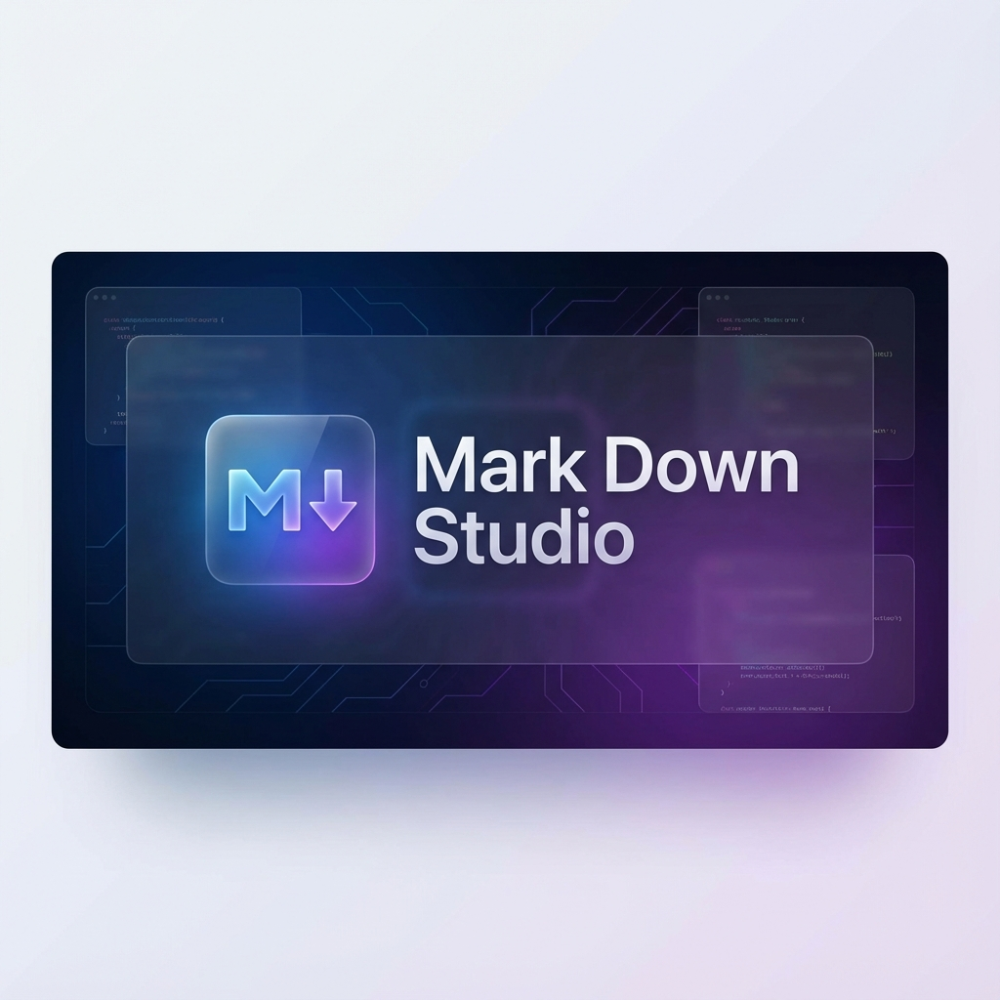
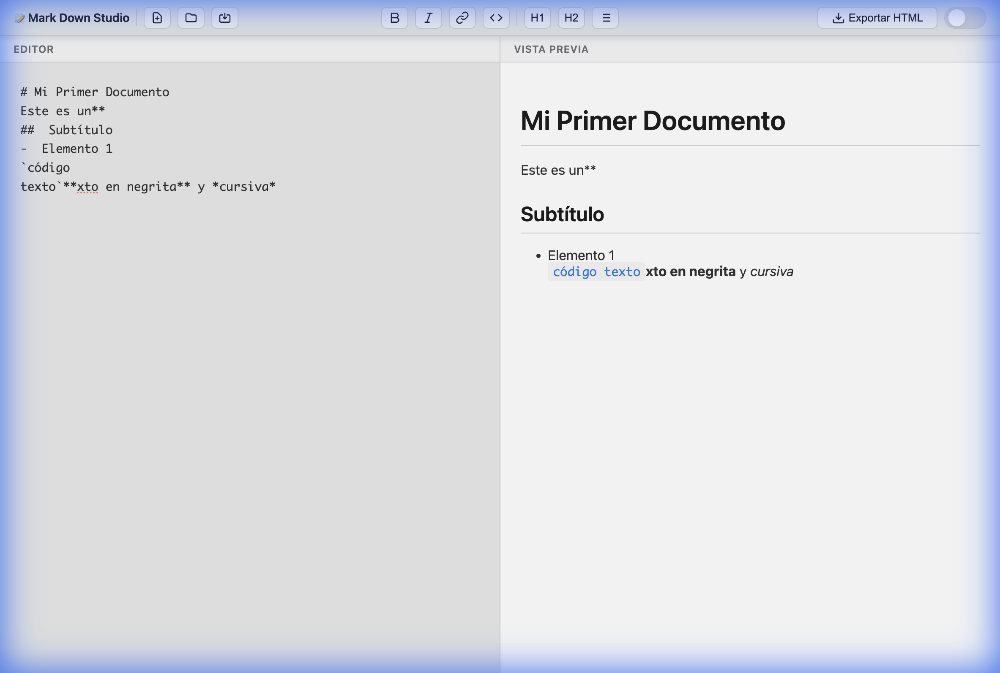
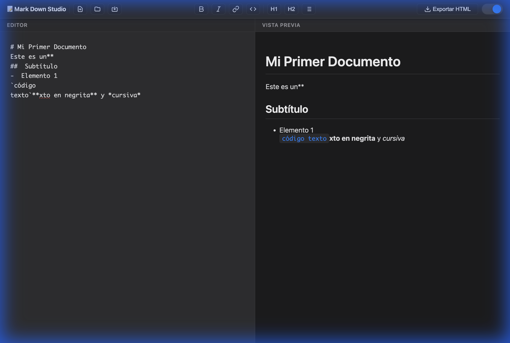

# 📝 Mark Down Studio

<div align="center">



**Un editor de Markdown moderno y elegante para macOS**

[](LICENSE)
[](package.json)
[](CONTRIBUTING.md)
[](https://github.com)

**[🚀 Ver Demo en Vivo](https://augustose.github.io/MarkDownStudio/)** | [Características](#-características) • [Instalación](#-inicio-rápido) • [Uso](#-atajos-de-teclado) • [Roadmap](#-roadmap) • [Contribuir](#-contribuciones)

</div>

---

## ✨ Características

### Funcionalidades Actuales (MVP)

- **✍️ Editor con Syntax Highlighting**: Escribe markdown con resaltado de sintaxis
- **👁️ Vista Previa en Tiempo Real**: Ve los cambios instantáneamente mientras escribes
- **🔄 Scroll Sincronizado**: El editor y la vista previa se desplazan juntos
- **💾 Operaciones de Archivo**: Nuevo, abrir, guardar archivos markdown
- **🎨 Formato Rápido**: Botones y atajos para negrita, cursiva, enlaces, código, etc.
- **📤 Exportar a HTML**: Genera archivos HTML con estilos incluidos
- **🌓 Modo Oscuro**: Alterna entre tema claro y oscuro
- **💻 Diseño macOS**: Interfaz inspirada en macOS Big Sur/Monterey
- **⌨️ Atajos de Teclado**: Cmd+S, Cmd+N, Cmd+B, Cmd+I, y más
- **💿 Auto-guardado**: Tu trabajo se guarda automáticamente en localStorage

## 📸 Demo

<div align="center">

### Modo Claro


### Modo Oscuro


</div>

## 🚀 Inicio Rápido

### Instalación

```bash
# Navega al directorio del proyecto
cd MarkDownStudio

# Instala las dependencias
npm install

# Inicia el servidor de desarrollo
npm run dev
```

La aplicación se abrirá automáticamente en tu navegador en `http://localhost:3000`

### Uso Básico

1. **Escribir**: Escribe markdown en el panel izquierdo
2. **Previsualizar**: Ve el resultado renderizado en el panel derecho
3. **Formatear**: Usa los botones de la barra de herramientas o atajos de teclado
4. **Guardar**: Cmd+S para descargar tu archivo .md
5. **Exportar**: Haz clic en "Exportar HTML" para generar un archivo HTML

## ⌨️ Atajos de Teclado

| Atajo | Acción |
|-------|--------|
| `Cmd+N` | Nuevo archivo |
| `Cmd+O` | Abrir archivo |
| `Cmd+S` | Guardar archivo |
| `Cmd+B` | **Negrita** |
| `Cmd+I` | *Cursiva* |
| `Cmd+K` | Insertar enlace |
| `Cmd+E` | Código inline |

## 🎨 Características de Diseño

- **Glassmorphism**: Efectos de vidrio esmerilado en la barra de herramientas
- **Transiciones Suaves**: Animaciones fluidas en todos los elementos interactivos
- **Scrollbars Personalizados**: Diseño coherente con el tema de la aplicación
- **Responsive**: Se adapta a diferentes tamaños de pantalla
- **Tipografía macOS**: Usa las fuentes del sistema de Apple

## 📋 Sintaxis Markdown Soportada

- Encabezados (H1-H6)
- Negrita y cursiva
- Enlaces e imágenes
- Listas ordenadas y desordenadas
- Bloques de código con syntax highlighting
- Citas
- Tablas
- Líneas horizontales
- Y más...

## 🛠️ Tecnologías

- **HTML5** - Estructura
- **CSS3** - Estilos con variables CSS y glassmorphism
- **JavaScript (Vanilla)** - Lógica de la aplicación
- **Marked.js** - Parser de Markdown
- **Highlight.js** - Syntax highlighting para código
- **DOMPurify** - Sanitización de HTML

## 📁 Estructura del Proyecto

```
MarkDownStudio/
├── index.html          # Estructura principal de la aplicación
├── styles.css          # Sistema de diseño y estilos
├── app.js             # Lógica de la aplicación
├── package.json       # Dependencias y scripts
├── README.md          # Este archivo
└── ROADMAP.md         # Funcionalidades futuras planificadas
```

## 🗺️ Roadmap

Para ver las funcionalidades planificadas para futuras versiones, consulta [ROADMAP.md](ROADMAP.md).

**Próximas fases incluyen:**
- 🎯 Modo Focus y estadísticas de escritura
- 📁 Sistema de workspace con tags y backlinks
- 🔄 Integración Git y sincronización cloud
- 📤 Exportación a PDF, DOCX, ePub
- 🤖 Asistente de IA y traducción
- 🍎 Extensiones nativas de macOS

## 🤝 Contribuciones

¡Las contribuciones son bienvenidas! Por favor lee nuestra [Guía de Contribución](CONTRIBUTING.md) para conocer el proceso.

### Formas de Contribuir
- 🐛 Reportar bugs
- 💡 Sugerir nuevas funcionalidades
- 📝 Mejorar la documentación
- 🔧 Enviar pull requests
- ⭐ Dar una estrella al proyecto

## 📄 Licencia

Este proyecto está bajo la Licencia MIT - ver el archivo [LICENSE](LICENSE) para más detalles.

## 🙏 Agradecimientos

- [Marked.js](https://marked.js.org/) - Parser de Markdown
- [Highlight.js](https://highlightjs.org/) - Syntax highlighting
- [DOMPurify](https://github.com/cure53/DOMPurify) - Sanitización HTML

## 📞 Contacto

¿Tienes preguntas o sugerencias? 
- 🐛 [Reportar un bug](../../issues/new)
- 💡 [Sugerir una funcionalidad](../../issues/new)
- ⭐ [Dar una estrella](../../stargazers)

---

<div align="center">

**Hecho con ❤️ para la comunidad de escritores y desarrolladores**

[⬆ Volver arriba](#-mark-down-studio)

</div>
